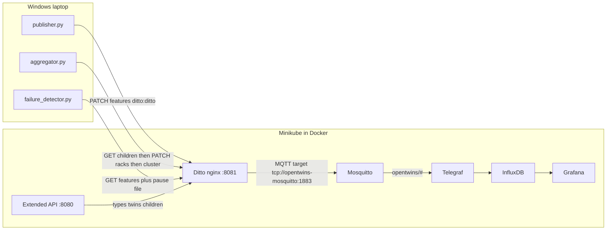

# Cluster Twin — OpenTwins proof of concept

This repository is **application code** for a compute-cluster digital twin. It is **not** the OpenTwins platform, **not** a Docker Compose stack, and **not** a Helm chart.

The twin runs against an **already-deployed OpenTwins Helm release inside Minikube** (Eclipse Ditto, Ditto Extended API, Mosquitto, Telegraf, InfluxDB v2, Grafana). This repo talks to that stack over `kubectl port-forward` to localhost.

**Last live walkthrough of this README:** 2026-08-25 (Windows 11, Minikube v1.38.1 docker driver, Python 3.12.10 venv). Claims below that are marked as that session were observed then. Dated files under `notes/` are historical; do not mix their numbers into this page.

Paper analog (Robles / Martín / Díaz 2023, *Computers in Industry*): Factory → Robot → Sensor becomes **Cluster → Rack → Node**. This PoC does **not** reproduce the paper’s Hono → Kafka inbound path, Kafka-ML failure prediction, or Unity 3D panel.

## Contents

1. [What this is / is not](#what-this-is--is-not)
2. [Runtime topology](#runtime-topology)
3. [Composition](#composition)
4. [Data path](#data-path)
5. [Repo map](#repo-map)
6. [Local endpoints and credentials](#local-endpoints-and-credentials)
7. [Windows operator run (cold start and warm start)](#windows-operator-run-cold-start-and-warm-start)
8. [Verification commands per hop](#verification-commands-per-hop)
9. [Grafana dashboard](#grafana-dashboard)
10. [Known gaps and operational traps](#known-gaps-and-operational-traps)
11. [Document index](#document-index)
12. [Acknowledgments](#acknowledgments)

---

## What this is / is not

| This repo **is** | This repo **is not** |
|---|---|
| Python processes that PATCH / GET Eclipse Ditto Things | A docker-compose OpenTwins install |
| Setup scripts for Twin Types + instance tree | Helm charts or Kubernetes YAML |
| A portable Grafana dashboard JSON | Eclipse Hono, Kafka, Kafka-ML, or Unity |
| Lab evidence of compositional twins + real outbound MQTT → Telegraf → Influx | A production-scale cluster twin |

Three counts people mix up:

| Count | What it is |
|------:|---|
| **13** | Instance twins: 1 cluster + 2 racks + 10 nodes |
| **16** | Things in namespace `hnguyen.clustertwin`: those 13 + 3 Twin Types |
| **10** | Lines on the top Grafana panel (nodes only). Racks and the cluster are other panels. |

2026-08-25 Ditto search returned exactly those 16 `thingId`s. Extended API `GET /api/types/all` returned 3 types.

---

## Runtime topology

Docker Desktop runs **one** container named `minikube`. OpenTwins pods run **inside** that Kubernetes cluster. Your laptop reaches them only through port-forwards.

**`docker ps` showing `minikube Up` is not sufficient.** After a Docker bounce the VM can look Running while kubelet/apiserver are Stopped and kubeconfig still points at the **previous** API port. 2026-08-25 before recovery: host Running, kubelet Stopped, apiserver Stopped, kubeconfig wanted `127.0.0.1:52626` but kubectl used `127.0.0.1:60023`. Fix: `minikube start` then `minikube update-context`. Confirm `minikube status` shows kubelet **Running**, apiserver **Running**, kubeconfig **Configured**.



This repo contains **no** `Dockerfile`, **no** `docker-compose` file, **no** Helm chart. The Helm release name is `opentwins` in namespace `default`. 2026-08-25: `helm status opentwins` still reports **STATUS: failed** (original install 2026-07-26 timed out waiting for pods). **Pods were nonetheless Ready.** Do not treat Helm `failed` as “the stack is down,” and do not `helm uninstall` / `minikube delete` to “fix” that status.

---

## Composition

Namespace: `hnguyen.clustertwin`. Thing IDs are always `namespace:name`. Bare `node_0` is invalid on the Ditto HTTP API (colon must be URL-encoded as `%3A` in paths).

### Twin Types (schema graph)

| Type ID | Child type | Cardinality |
|---|---|---:|
| `hnguyen.clustertwin:NodeType` | — | — |
| `hnguyen.clustertwin:RackType` | NodeType | **5** |
| `hnguyen.clustertwin:ClusterType` | RackType | **2** |

On **types**, `_parents` is a map `{ "<parentTypeId>": <cardinality> }`. 2026-08-25 live:

- NodeType `_parents` = `{ "hnguyen.clustertwin:RackType": 5 }`
- RackType `_parents` = `{ "hnguyen.clustertwin:ClusterType": 2 }`
- ClusterType has no parent (root)

All ten node **instances** share one NodeType. Cardinality 5 is “how many nodes sit under one rack,” not “there are five node types.”

### Instance tree

```
hnguyen.clustertwin:main_cluster
├── hnguyen.clustertwin:rack_0 → node_0 … node_4
└── hnguyen.clustertwin:rack_1 → node_5 … node_9
```

On **twins**, `_parents` is a single parent Thing ID string. 2026-08-25 live: every node_0..4 → `rack_0`, node_5..9 → `rack_1`, both racks → `main_cluster`. Links are Extended API `PUT /api/twins/{parent}/children/{child}`, not name-prefix grouping.

`POST /api/types/{typeId}/create/{twinId}` recursively instantiates linked children. [scripts/setup_types_and_twins.py](scripts/setup_types_and_twins.py) therefore: links types and checks cardinality → temporarily unlinks type children → creates each twin with an explicit ID → links instance children → re-links the type graph. 2026-08-25 the 16 Things already existed, so setup was **not** re-run.

Attributes (static) vs features (dynamic): see [notes/twin_design_spec.md](notes/twin_design_spec.md). Nodes hold `cpu_utilization`, `memory_utilization`, `active_connections`, `latency_ms`. Racks and the cluster hold `avg_cpu_utilization`, `total_active_connections`, `healthy_node_count`.

Aggregation ([twin/aggregator.py](twin/aggregator.py)):

- Healthy node: CPU utilization **< 80**
- Each rack: mean CPU, sum of connections, count of healthy children (from its five nodes)
- Cluster: mean of the **two rack averages**, sum of rack connection totals, sum of rack healthy counts — **never re-reads the ten nodes**

2026-08-25 one aggregator cycle: `rack_0 avg_cpu=21.79` `rack_1 avg_cpu=43.24` → `CLUSTER avg_cpu=32.52 (from racks [21.79, 43.24])` `healthy=10` HTTP 204.

---

## Data path

### Inbound (simplified)

[twin/publisher.py](twin/publisher.py) PATCHes each node’s features on Ditto HTTP (`http://localhost:8081/api/2/things/{thingId}/features`) as `ditto:ditto`, `Content-Type: application/merge-patch+json`, default interval 3 s.

There is **no** Ditto MQTT **source** connection and **no** Eclipse Hono / Kafka in this deployment.

2026-08-25: three publisher cycles → **30 × HTTP 204** (then two more cycles → another 20 × 204). `node_0` is a deliberate multi-minute CPU/latency ramp (~6 minutes to ~95% CPU), not random like the other nine.

If Ditto or the port-forward dies, publisher and aggregator **crash** (unhandled `ConnectionError`). They do not retry.

### Outbound (real platform path)

1. Ditto Connectivity **target** connection `ClusterTwin MQTT events to Mosquitto`
2. URI **inside the cluster**: `tcp://opentwins-mosquitto:1883` — Ditto pods resolve Kubernetes DNS. Do **not** change this to `localhost`.
3. Topic address: `opentwins/hnguyen.clustertwin/{{ thing:name }}` (example: `opentwins/hnguyen.clustertwin/node_0`)
4. Telegraf (ConfigMap `opentwins-telegraf-real-config`): MQTT `opentwins/#`, `data_format = "json_v2"`, `flush_interval = "10s"` (confirmed live 2026-08-25)
5. InfluxDB v2: `org=opentwins`, `bucket=default`, measurement `mqtt_consumer`
6. Grafana datasource name `opentwins`

The connection **does not survive cluster restart**. Recreate with `python scripts\phase5_mqtt_influx.py create-connection` (`devops:foobar` on `/api/2/connections` only). 2026-08-25 recreated: HTTP 201, `connectionStatus: "open"`, new id generated by Ditto (ids are not stable; do not hard-code them).

Host-side MQTT for the **manual** Telegraf test is `localhost:1883`. That is a different hop from Ditto’s in-cluster URI.

2026-08-25 Influx after publisher + aggregator:

- `thingId=hnguyen.clustertwin:node_0` field `value_cpu_utilization_properties_value` values 10.0 / 11.58 / 12.92, tag `parent=hnguyen.clustertwin:rack_0`
- `thingId=hnguyen.clustertwin:rack_0` field `value_avg_cpu_utilization_properties_value` = 21.79, `parent=hnguyen.clustertwin:main_cluster`
- `thingId=hnguyen.clustertwin:main_cluster` same avg field = 32.52
- Example topic tag: `opentwins/hnguyen.clustertwin/node_7`

### Failure detector (simplified vs paper §3.3)

[twin/failure_detector.py](twin/failure_detector.py) polls node features (~2 s) and compares signatures. Tolerance default **9 s**. Pause a node by writing its Thing ID to `notes/_paused_nodes.json` (publisher skips those IDs). On timeout it logs `FAILED` and **does not PATCH Ditto**. “Hold last-known value” is **passive**. The paper predicts a next value via Kafka-ML.

`--pause` / `--resume` are one-shot CLI writes to the pause file; the long-running loop does not write that file.

2026-08-25: after publisher stopped, the detector logged `FAILED` for all 10 nodes at ~9.8 s with held CPU/latency. That is expected when nothing is PATCHing. It is **not** a live pause-file demo.

---

## Repo map

| Path | Role |
|---|---|
| [twin/config.py](twin/config.py) | `.env` + Thing/type IDs |
| [twin/ditto_client.py](twin/ditto_client.py) | HTTP helpers, Basic Auth `ditto:ditto` |
| [twin/publisher.py](twin/publisher.py) | Inbound PATCH |
| [twin/aggregator.py](twin/aggregator.py) | Rack then cluster aggregation |
| [twin/failure_detector.py](twin/failure_detector.py) | Stale-node detector |
| [twin/README.md](twin/README.md) | Package-level CLI notes (this file is the operator/architecture doc) |
| [scripts/setup_types_and_twins.py](scripts/setup_types_and_twins.py) | Create types, instances, links |
| [scripts/phase5_mqtt_influx.py](scripts/phase5_mqtt_influx.py) | `create-connection` / `status` / `manual-test` / `query` |
| [scripts/port-forwards.ps1](scripts/port-forwards.ps1) | Five `kubectl port-forward`s |
| [scripts/fault_tolerance_test.py](scripts/fault_tolerance_test.py) | **Destructive:** kills a Ditto pod. Dated results only. |
| [notes/scaling_benchmark.py](notes/scaling_benchmark.py) | Dual-metric lab bench. **Overwrites** `notes/scaling_results.json`. |
| [grafana/dashboard.json](grafana/dashboard.json) | Portable dashboard (datasource UID `opentwins` in JSON) |
| [notes/twin_design_spec.md](notes/twin_design_spec.md) | Attribute/feature and connection design |
| [requirements.txt](requirements.txt) | `requests`, `python-dotenv`, `paho-mqtt`, `influxdb-client`, `matplotlib` (lower bounds, not pins) |
| [.env.example](.env.example) | Copy to `.env` (gitignored) and set `INFLUX_TOKEN` |

---

## Local endpoints and credentials

| Local port | Service | 2026-08-25 check |
|---:|---|---|
| 8080 | Extended API (`svc/opentwins-ditto-extended-api` → 8080) | `GET /api/types/all` as `ditto:ditto` → HTTP 200, 3 types |
| 8081 | Ditto HTTP (`svc/opentwins-ditto-nginx` → 8080) | `GET /api/2/search/things?namespaces=hnguyen.clustertwin&option=size(50)` → HTTP 200, 16 items |
| 3000 | Grafana (`svc/opentwins-grafana` → 80) | `GET /api/health` → `database: ok`, version **12.3.0** |
| 8086 | InfluxDB (`svc/opentwins-influxdb2` → 80) | `GET /health` → `pass`, version **v2.7.4**; `GET /ready` → `ready` |
| 1883 | Mosquitto (`svc/opentwins-mosquitto` → 1883) | TCP connect succeeded |

Auth (this lab, 2026-08-25):

| API | User | Password | Use |
|---|---|---|---|
| Ditto Things / Extended API | `ditto` | `ditto` | Twins, types, PATCH/GET. Subject `nginx:ditto`. |
| Ditto Connectivity | `devops` | `foobar` | `/api/2/connections` only. **Never** against per-Thing policies. |
| Grafana form + Basic Auth | `admin` | `AuditPass123!` | `POST /login` → HTTP 200 `"Logged in"`; `GET /api/org` → 200. |
| Grafana `admin` / `admin` | — | — | **HTTP 401** (`password-auth.failed`) |

If Grafana’s PVC is wiped, the Kubernetes Secret may restore the platform default `admin`/`admin` and `AuditPass123!` will fail. Re-check live; do not assume either password forever.

`INFLUX_TOKEN` lives only in `.env` (256 characters set this session). Copy it from ConfigMap `opentwins-telegraf-real-config`. **Do not commit `.env`.**

---

## Windows operator run (cold start and warm start)

Working directory for every command:

```powershell
cd "C:\Users\minhh\Side Hustles\digi-twin"
.\venv\Scripts\Activate.ps1
```

### 1. Control plane

```powershell
docker ps
minikube status
minikube start
minikube update-context
minikube status
kubectl get pods -n default
```

Wait until OpenTwins pods show Ready (`1/1` or Grafana `3/3`). 2026-08-25 cold start: several pods sat in `Error` for ~2–3 minutes (Grafana init downloading GitHub plugin zips; Ditto readiness `connection refused` until Mongo/Influx came up). Influx became `1/1 Running` after a restart; Grafana `install-opentwins-plugins` retried then the pod reached `3/3`. **Do not start port-forwards while nginx/Influx/Grafana are still Error/Pending.**

Do **not** `minikube delete` or `helm uninstall`.

### 2. Port-forwards

```powershell
Get-Process kubectl -ErrorAction SilentlyContinue | Stop-Process -Force
.\scripts\port-forwards.ps1
netstat -ano | findstr "LISTENING" | findstr "8080 8081 3000 8086 1883"
```

[scripts/port-forwards.ps1](scripts/port-forwards.ps1) backgrounds `kubectl` via `Start-Process` and **prints success even if binds fail**. Trust `netstat` plus a real HTTP call, never the banner. 2026-08-25: all five ports LISTENING on `127.0.0.1` after one run.

Do not launch the script twice without killing leftover `kubectl` (port already in use).

### 3. `.env`

```powershell
copy .env.example .env
# set INFLUX_TOKEN from:
kubectl get configmap opentwins-telegraf-real-config -o yaml
```

### 4. Types / twins (if the namespace is empty)

```powershell
python scripts\setup_types_and_twins.py
```

Skip if search already returns the 16 Things with correct `_parents`.

### 5. MQTT connection (every cluster restart)

```powershell
python scripts\phase5_mqtt_influx.py create-connection
python scripts\phase5_mqtt_influx.py status
```

Expect `connectionStatus: "open"` and URI `tcp://opentwins-mosquitto:1883`.

### 6. Three processes — **three terminals**

`publisher.py` never returns. Pasting all three into one PowerShell window will never start aggregator/detector (Grafana rack/cluster panels stay empty).

```powershell
python -u twin\publisher.py
```

```powershell
python -u twin\aggregator.py
```

```powershell
python -u twin\failure_detector.py
```

Finite checks (used 2026-08-25):

```powershell
python -u twin\publisher.py --cycles 3
python -u twin\aggregator.py --cycles 2
python -u twin\failure_detector.py --duration 20
```

Pause / resume one node:

```powershell
python twin\failure_detector.py --pause node_1
python twin\failure_detector.py --resume node_1
```

Optional MQTT → Influx marker test (needs `INFLUX_TOKEN`):

```powershell
python scripts\phase5_mqtt_influx.py manual-test
python scripts\phase5_mqtt_influx.py query
```

---

## Verification commands per hop

Run after forwards are up. Encoding: `hnguyen.clustertwin:node_0` → `hnguyen.clustertwin%3Anode_0`.

```powershell
curl.exe -s -u ditto:ditto http://localhost:8080/api/types/all
curl.exe -s -u ditto:ditto "http://localhost:8081/api/2/search/things?namespaces=hnguyen.clustertwin&option=size(50)"
curl.exe -s -u ditto:ditto http://localhost:8081/api/2/things/hnguyen.clustertwin%3Anode_0
curl.exe -s http://localhost:3000/api/health
curl.exe -s http://localhost:8086/health
curl.exe -s http://localhost:8086/ready
```

Children:

```powershell
curl.exe -s -u ditto:ditto http://localhost:8080/api/twins/hnguyen.clustertwin%3Amain_cluster/children
curl.exe -s -u ditto:ditto http://localhost:8080/api/twins/hnguyen.clustertwin%3Arack_0/children
```

Do **not** run as part of a docs/demo warm-up:

- `python scripts\fault_tolerance_test.py` — deletes a `ditto-things` pod; overwrites [notes/fault_tolerance_results.md](notes/fault_tolerance_results.md) unless you merge by hand
- `python notes\scaling_benchmark.py` — overwrites [notes/scaling_results.json](notes/scaling_results.json)

Those files remain **dated lab results** (2026-07-28 through 2026-08-13). This session did not re-run them.

---

## Grafana dashboard

- URL: http://localhost:3000/d/clustertwin-main/cluster-twin-compute-monitoring
- UID: `clustertwin-main`
- Title: `Cluster Twin - compute monitoring`
- Login (2026-08-25): `admin` / `AuditPass123!` (not `admin`/`admin`)
- Repo JSON [grafana/dashboard.json](grafana/dashboard.json) pins datasource UID **`opentwins`**. Live Grafana (2026-08-25) has one Influx datasource: name `opentwins`, UID **`P4528D75AB74BE2EA`**, URL `http://opentwins-influxdb2:80`. Live dashboard **version 5** already uses `P4528D75AB74BE2EA` on all four panels. If you re-import the repo JSON, remap UID `opentwins` → that live UID.

| Panel | Title | 2026-08-25 `POST /api/ds/query` |
|---:|---|---|
| 1 | Per-node CPU utilization (all 10 nodes) | HTTP 200, **10** frames `node_0`…`node_9` |
| 2 | Per-rack avg CPU | HTTP 200, **2** frames `rack_0`, `rack_1` |
| 3 | Cluster avg CPU (from racks) | HTTP 200, **1** frame `main_cluster` |
| 4 | Current node state (sorted by CPU descending) | HTTP 200, **10** rows, columns `CPU %`, `Rack`, `Node` |

Panel 4 Flux uses `range(start: -2m)`. If publisher has been stopped for more than two minutes the table is empty even when panels 1–3 still show older points. Start publisher (and aggregator for rack/cluster lines), wait for Telegraf’s **10 s** flush.

JSON default time range is `now-15m`, refresh `5s`. For a meeting, operators have used refresh **Off** and range **Last 6 hours** — that is a UI choice, not what the committed JSON defaults to.

Ignore Grafana DevTools `public-dashboards` 404 (public sharing is not enabled). Browser-extension console noise is not an app failure.

No desktop-browser click-through was available in the 2026-08-25 agent session; panels were proven via Grafana’s query API after a real form login, not via a screenshot.

---

## Known gaps and operational traps

1. **Inbound is HTTP PATCH**, not Hono → Kafka. Outbound MQTT → Telegraf → Influx **is** the platform path.
2. **Failure detector is hold-last-value (passive)**, not Kafka-ML prediction.
3. **No Unity / WebGL** visualization (Grafana still installs OpenTwins plugin zips, including a Unity panel zip, during pod init; this PoC does not use that panel).
4. **Publisher and aggregator exit on Ditto outage.** Restart them after port-forward or pod recovery.
5. **Port-forwards die silently** over long Windows sessions. Re-check `netstat` + curl, not the script banner.
6. **Docker bounce** moves the Minikube API port and can stop kubelet while `docker ps` still shows `minikube`.
7. **Influx / Grafana / nginx** can sit in `Error` for minutes after `minikube start`. Wait for Ready. Grafana init downloads from GitHub and can BackOff.
8. **Helm `STATUS: failed`** from the 2026-07-26 install timeout does not match current Ready pods. Do not “repair” it with uninstall during a demo.
9. **Single-instance SPOFs** on this minikube: Ditto things, MongoDB, Mosquitto, Telegraf, Influx, laptop port-forwards. Not a production topology.
10. **Do not cite a single fault-recovery second** from memory. See dated [notes/fault_tolerance_results.md](notes/fault_tolerance_results.md). Paper Test 3 (Hono MQTT adapter, 52.46 s) is a **different failure mode**.
11. **Do not treat Influx visibility latency as Ditto’s scalability ceiling.** Telegraf `flush_interval = 10s` dominates metric (b). Dated dual-metric notes: [notes/scaling_comparison.md](notes/scaling_comparison.md), [notes/SCALING_READINESS.md](notes/SCALING_READINESS.md).

---

## Document index

**Current (prefer these for how the system works and how to run it)**

| File | Role |
|---|---|
| [README.md](README.md) | This file — architecture + Windows operator + 2026-08-25 live checks |
| [notes/twin_design_spec.md](notes/twin_design_spec.md) | Type/instance model, aggregation rules, connection JSON |
| [twin/README.md](twin/README.md) | What the three Python processes do |
| Code under `twin/` and `scripts/` | Source of truth if a note disagrees |

**Dated snapshots (do not treat as live cluster state)**

| File | Session |
|---|---|
| [notes/VERIFICATION_REPORT.md](notes/VERIFICATION_REPORT.md) | 2026-07-28 audit (some sections later corrected) |
| [notes/SCALING_READINESS.md](notes/SCALING_READINESS.md) | 2026-07-28 / updated 2026-08-13 |
| [notes/scaling_comparison.md](notes/scaling_comparison.md) | 2026-07-28 and 2026-08-12 benches |
| [notes/fault_tolerance_results.md](notes/fault_tolerance_results.md) | 2026-07-28 … 2026-08-13 pod-kill samples |
| [notes/PROFESSOR_SUFFICIENCY_AUDIT.md](notes/PROFESSOR_SUFFICIENCY_AUDIT.md) | 2026-08-11 |
| [notes/FINAL_READINESS_AUDIT.md](notes/FINAL_READINESS_AUDIT.md) | 2026-08-12 |
| [notes/FINAL_GATE_SUMMARY.md](notes/FINAL_GATE_SUMMARY.md) | 2026-08-13 |
| [notes/fallback_export/](notes/fallback_export/) | 2026-08-12 JSON backups |

Those audits **disagree with each other** on fault-recovery mean, Grafana login, git hygiene, and 20-client HTTP 503s. That is expected for dated files. This README does not blend those numbers.

**Meeting / professor material (tracked)**

[notes/PROFESSOR_DEMO_PLAYBOOK.md](notes/PROFESSOR_DEMO_PLAYBOOK.md), [notes/DEMO_REQUEST_EMAIL.md](notes/DEMO_REQUEST_EMAIL.md), [notes/EMAIL_TO_PROF_RESCHEDULE.md](notes/EMAIL_TO_PROF_RESCHEDULE.md) — leave as meeting drafts. Prefer this README for technical procedure.

**Local / gitignored (exist on this machine; not in git)**

`.gitignore` excludes `notes/MEETING_SCRIPT_FINAL.md`, `notes/MEETING_LINKS.md`, `notes/DEMO_DAY_OPERATOR_RUNBOOK.md`, and `notes/_*`. They are **present locally**, not missing. Runtime files such as `notes/_paused_nodes.json`, `notes/_failure_state.json`, `notes/_connection_id.txt` are also gitignored.

---

## Acknowledgments

This PoC **consumes** the [OpenTwins](https://github.com/ertis-research/opentwins) platform (Apache License 2.0). This repository does not vendor that platform’s charts or images. Original work here is the cluster-twin model, Python processes, setup/MQTT scripts, and Grafana dashboard JSON.
